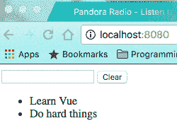

# 姜戈视图，第二部分

> 原文：<https://dev.to/rpalo/vue-on-django-part-2>

注意:本教程已经有几年的历史了，并且使用了 Django 和 Vue 的过时版本。我目前没有足够的时间来浏览和更新它，但如果有人想做繁重的工作，我很乐意合作。就目前而言，这些文章应该能够理解概念，但是代码不会与当前的 Vue 或 Django 文档相匹配。

这是我制作一个由 Django REST 后端支持的 Vue 应用程序的教程的第 2 部分。在第一部分，我们只设置了 Vue 端。第 2 部分将是最难的部分，建立数据模型。最后，第 3 部分——下次——将是 Django 后端。本教程将假设 JavaScript 语法的工作知识，但我将尝试解释一些涉及的基础设施。再说一次，让我们开始吧。

## 1。Vuex 简介

Vuex 是“前端的后端”,我们将使用它(最终)与 REST 后端接口。设置这个的好处是，我们可以将所有前端组件绑定到我们的数据存储中，并且不指向数据存储。有了这些，存储将只对内存中的内容进行操作。但是一旦我们准备好指向我们的 django 服务器，我们所要做的就是稍微调整一下，而不需要改变整个前端的动作。一旦连接上，Vuex 将帮助我们看起来做事情超快，而实际上，我们可能正在发送一个缓慢的网络调用来更新数据库。它会在后台处理这些开销，同时让用户在待办事项列表上大搞破坏。

为了开始，我们所需要的是第 1 部分之后的内容，并安装 Vuex。

```
$ npm install --save vuex 
```

Enter fullscreen mode Exit fullscreen mode

## 2。创建商店

创建一个文件夹`src/store/`并在该文件夹中创建`store.js`。Vuex 商店由几个模块化部件组成，类似于 Vue 组件的方式。对于这个应用程序，我们将只使用其中的三个:T2、T3 和 T4。下面显示了它们与我们应用程序其余部分的关系。

[T2】](https://res.cloudinary.com/practicaldev/image/fetch/s--bdp60Q7f--/c_limit%2Cf_auto%2Cfl_progressive%2Cq_auto%2Cw_880/http://assertnotmagic.com/img/vuex-flowchart.png)

`State`表示您的数据的状态。`todos`的电流值是多少？您的组件可以直接从这个状态中读取(或者通过`getters`,如果有一些处理要做的话)。我们现在不讨论这个)，但是为了写入它，他们需要通过动作。一个组件可以`dispatch`一个动作，动作可以是任意异步的。一旦这个动作完成了所有的副作用，比如点击数据库，它就会`commit`一个`mutation`。A `mutation`是 Vuex `state`的同步变化，它们*必须*是同步的。明白了吗？动作:异步。突变:行动的最后一步，完全同步。不管怎样，太多理论了。嘘理论。更多代码！下面是`store.js`的内容。

```
// store.js

import Vue from 'vue'
import Vuex from 'vuex'

Vue.use(Vuex) // only required if you're using modules.
              // We're using modules, so there you go.

const store = new Vuex.Store({
  state: {
    todos: [
      { text: 'Learn Vue.' },
      { text: 'Do hard things.' }
    ]
  },
  mutations: {
    'ADD_TODO': function (state, todo) {
      state.todos.push(todo)
    },
    'CLEAR_TODOS': function (state) {
      const todos = state.todos
      todos.splice(0, todos.length)
    }
  },
  actions: {
    addTodo (store, todo) {
      store.commit('ADD_TODO', todo)
    },
    clearTodos (store) {
      store.commit('CLEAR_TODOS')
    }
  }
})

export default store 
```

Enter fullscreen mode Exit fullscreen mode

你可以看到我们上面谈到的大部分作品。我们的行动可以(也将会)做得更多，但目前它们只是通过和`commit`各自的突变。你可以看到，如果我们有更多的突变和/或动作，我们会想把它们分成单独的文件:`actions.js`和`mutations.js`，并分别导入它们。突变也不一定都是大写的。您可以像操作一样将它们声明为就地函数(如果您愿意，甚至可以使用与操作相同的名称)。我看到的教程使用了`SCREAMING_SNAKE` case，我有点喜欢它，因为它帮助我区分动作和突变。做你想做的，这是你的人生。

## 3。使用商店

好吧！现在，我们需要让这个美味的小商店可用于我们的应用程序。修改您的`main.js`文件，如下所示。

```
// main.js

import Vue from 'vue'

import App from './App'
import store from './store/store.js'

/* eslint-disable no-new */
new Vue({
  el: 'body',
  store: store,
  components: { App }
}) 
```

Enter fullscreen mode Exit fullscreen mode

现在，我们的存储将可以从组件中获得。下面是新闪亮的`TodoList.vue`。

```
// src/components/TodoList.vue

<template>
  <div id="todolist">
    <ul>
      <todo v-for="todo in todos"
            v-bind:todo="todo" 
            v-bind:key="todo.id">
      </todo>
    </ul>
  </div> </template> 
<script>
import Todo from './Todo.vue'

export default {
  components: {
    Todo
  },
  computed: {
    todos () {
      return this.$store.state.todos
    }
  }
}
</script> 
```

Enter fullscreen mode Exit fullscreen mode

你会注意到商店实际上只有一个变化。我们将组件的`data`键更改为`computed`部分。这使得我们的组件可以随着外部数据的变化而更新。`Computed`包含您引用的每个变量的函数。在我们的情况下，这只是托多斯。我们用`$store`引用 store 对象，并可以直接从中读取，就像我们之前讨论的那样。还请注意，我也调整了模板，使其工作得更好。我取出了`li`元素，并将`v-for`直接放置在`todo`中。我不确定，但我觉得我们以前不会有这样的结果。太好了。这里的变化就这么多。接下来是`Todo.vue`。

```
// src/components/Todo.vue

<template>
  <li>
    {{ todo.text }}
  </li> </template> 
<script>
export default {
  props: ['todo']
}
</script> 
```

Enter fullscreen mode Exit fullscreen mode

正如你所看到的，唯一的变化是修复了我之前的 booboo，把我们从`TodoList.vue`中取出的`li`元素放在这里，替换了`p`标签。我认为这也更加直观。继续前进到`UserInput.vue`。

```
// src/components/UserInput.vue

<template>
  <div id="user-inputs">
    <input v-model="newTodoText" v-on:keyup.enter="createTodo">
    <button v-on:click="clearTodos">
      Clear
    </button>
  </div> </template> 
<script>
export default {
  data: function () {
    return { newTodoText: '' }
  },
  methods: {
    createTodo () {
      this.$store.dispatch('addTodo', {text: this.newTodoText})
      this.newTodoText = ''
    },
    clearTodos () {
      this.$store.dispatch('clearTodos')
    }
  }
}
</script> 
```

Enter fullscreen mode Exit fullscreen mode

模板没有变化。我们在这里将`createTodo`方法更新为`dispatch`我们的`store`的`createTodo`动作。注意，我们可以传递一个新的 Todo 对象作为第二个参数给`dispatch`。`clearTodos`功能类似。这很有趣，因为你可以看到并不是所有的状态都保存在存储中。`newTodoText`变量不需要保存以备后用，所以我们把它保存在组件的`data`部分，而`store`甚至从不担心它。

## 4。看看我们的作品！

就是这样！在快速的`npm run dev`之后，你应该能够看到你的待办事项列表，预载了两个项目。尝试键入新的 todo 并按 enter 键。待办事项列表更新！尝试清除一切。一切都很好！

[T2】](https://res.cloudinary.com/practicaldev/image/fetch/s--uSf-ePzR--/c_limit%2Cf_auto%2Cfl_progressive%2Cq_66%2Cw_880/http://assertnotmagic.com/img/vue-part2-final.gif)

[T2】](https://res.cloudinary.com/practicaldev/image/fetch/s--RuOh4A9A--/c_limit%2Cf_auto%2Cfl_progressive%2Cq_66%2Cw_880/http://assertnotmagic.com/img/celebrate.gif)

一些常见的错误。如果你看到一个类似于`no such method as dispatch`的错误，这意味着你可能是这样创建你的商店的:`const store = {}`而不是`const store = new Vuex.Store({})`。还是那句话，如果上面写着`could not get /`，你很可能已经激怒了 ESLint 的神。检查你的终端，在那些函数之前留出一点空间。

像以前一样，我几乎是边学边写，所以如果我做错了什么或者你有更好的方法，让我知道。请继续关注第 3 部分！

*最初发布于[我的博客](http://assertnotmagic.com)T3】*