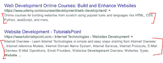

# WDS15 -处理您的元数据

> 原文：<https://dev.to/blackbird/wds15---handle-your-metadata-5g15>

在上一篇短文中，我们了解到:

*   在网页中显示网页的 HTML **iframe** 元素

在这篇文章中，我们将会看到一些不会对你如何看到你的网页产生直接影响的东西，但是会做很多背景工作。所以让我们开始吧...在关于 HTML 的第一篇文章中，在学习基本的 HTML 页面结构时，我们将 HTML 文档分为两个主要部分:头部和主体。这个头包含了关于 HTML 文档的元数据，我们把它写在 HTML 的主体中。让我们看看如何编写这些元数据...

HTML **< meta >** 元素

*   **< meta >** 元素用于指定关于网页的作者、文章的各种标签、页面描述等许多东西。
*   浏览器使用元数据来决定如何显示内容，搜索引擎根据标签和关键字对网页进行分类。

#### <u>HTML 字符集</u>

由计算机硬件和软件识别的字符的定义列表。每个字符由一个数字表示。为了正确显示一个 HTML 页面，网络浏览器必须知道使用哪种字符集(字符编码)。

例子:ASCII，UTF-8

大多数时候 UTF-8 应该工作得很完美。

**<meta charset = " UTF-8 ">**

#### <u>T3】描述 T5】</u>

[T2】](https://3.bp.blogspot.com/-24_Blrxs_c8/WjljU90s7pI/AAAAAAAAHLE/qcCcQiHfYuMmg52pSo2o-8_7QA_pjGDwgCLcBGAs/s1600/Capture8.PNG)

它被搜索引擎用来在链接到你的站点下面向用户显示相关信息，这样用户可以决定点击哪个链接。

**<meta name = " description " content = "这是 HTML 教程">**

#### <u>T3】关键词</u>

关键词就像你文档的标签，帮助搜索引擎在互联网上轻松搜索数百万份文档。您可以添加任意数量的关键字，用逗号分隔。

**<meta name = " keywords " content = " HTML，WebDevelopment，WDS，Coding" >**

#### <u>T3】作者</u>

当然，作者应该得到他/她的学分！

**< meta name= "作者" content= "编码速递">**

#### <u>刷新率</u>

你一定看过“体育比分直播”网站。他们总是显示正确的分数，而不需要你一次又一次的刷新。它由下列属性使用，其中 content 是以秒为单位的时间，在此时间后您要刷新页面。

**<meta http-equiv = " refresh " content = " 10 ">**

#### <u>视口</u>

HTML5 中引入了这一部分，帮助网页创建者决定网页的可视区域。该可视区域因设备而异。

最好的选择是将宽度设置为**设备宽度**，这样页面将被调整到小设备，如智能手机到大屏幕，如笔记本电脑或台式机。

我们还可以设置**初始缩放**，它决定页面在任何屏幕上初始加载时的缩放级别。

**<meta name = " viewport " content = " width = device-width，initial-scale=1.0" >**

*<u>**注意:**</u> 不写< head >标签和里面的所有东西也可以创建 HTML5 文档，但是不推荐这样做，因为它可以在各种屏幕和浏览器上随机输出。它也不会被搜索引擎优化，甚至有可能你的页面在搜索引擎上不容易被搜索到。*

今天到此为止。我们今天所学的，是你在创建实际网页时应该永远记住的非常重要的部分。在下一篇文章中，我们将看到一个你在世界上 99%的网站上看到的新的 HTML 概念。是的，真的！想想哪个是它和 _ **#keepCoding。** _