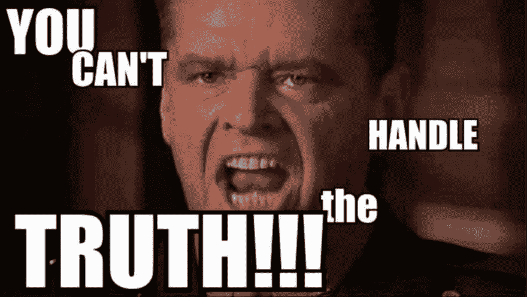
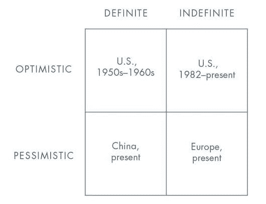
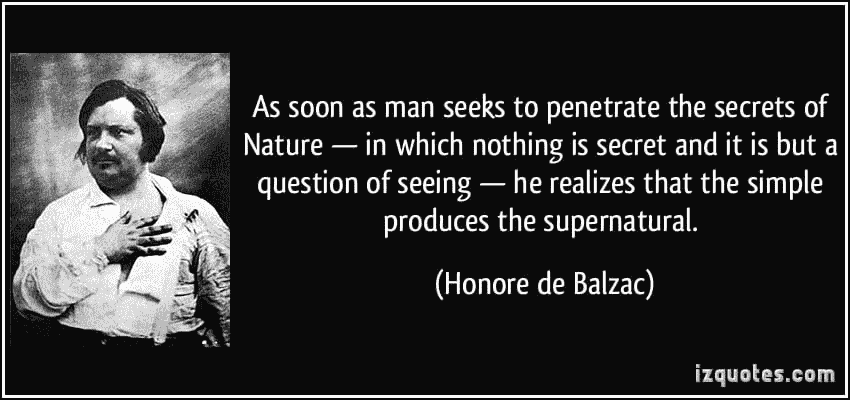
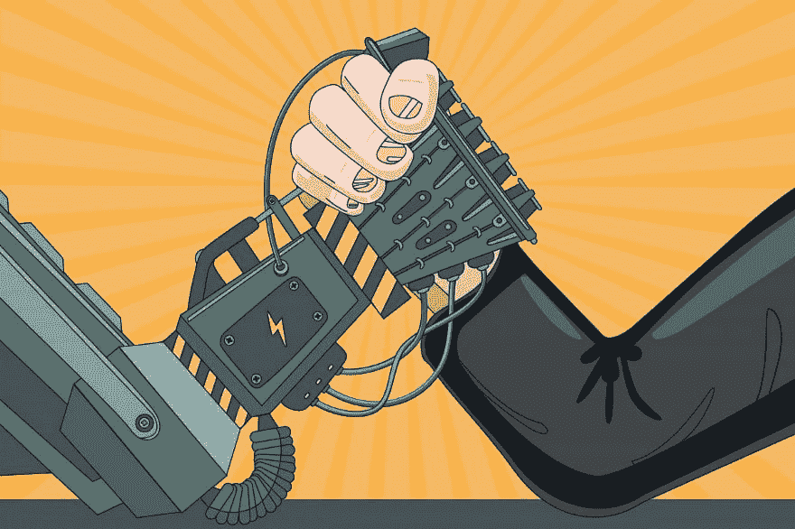

# 你冷门却重要的真理是什么？

> 原文：<https://dev.to/yordiverkroost/what-is-your-impopulair-but-important-truth-f86>

一年读 25 本书，这是 2018 年的挑战。是小说还是非小说不重要，只要是能看的书就行。你可以在[我的个人 Goodreads 简介](https://www.goodreads.com/user/show/75867053-yordi-verkroost)上关注我的进展。

今年我读的第一本书是贝宝创始人彼得·泰尔的《零比一》。这是一本为(想成为)企业家而写的书，正如这本书的副标题所准确描述的那样，书中有关于创业和如何建设未来的笔记。事实上，它包含了如何建立成功企业的技巧和诀窍。或者，忠于书名，如何从 0 到 1。这本书的主要思想是，从 1 到 *n* 相对容易(采用已经存在的东西并在其上扩展)，但从 0 到 1 非常困难(想一些完全新的、以前没有人做过的东西)。

以下是我从彼得·泰尔的*零到一*中总结出的五个要点(排名不分先后)。

# 你的重要真相

> 很少有人同意你的重要真理是什么？

[T2】](https://res.cloudinary.com/practicaldev/image/fetch/s--KSMUzAB3--/c_limit%2Cf_auto%2Cfl_progressive%2Cq_auto%2Cw_880/https://cdn-images-1.medium.com/max/880/1%2Awve9xW87sFrixGZA0VfCLQ.png)

上面的引用(不，不是来自*几个好人*)实际上是贯穿全书的主要思想。在某个阶段，它被翻译成它的商业等价物:*“没有人在建立什么有价值的公司？”*。正如书中所描述的(我也同意这一点)，这是一个非常简单的问题，但很难回答。给出了一些例子，但实际上许多人都同意，因此不是很好的答案，这些例子是:

*   我们的教育系统已经崩溃，急需修复
*   美国是例外(当然是在这个时刻，对吗？)
*   没有上帝

根据这本书，任何好的答案都必须在某种程度上归结为:*“大多数人相信 x，但事实与 x 相反”*。泰尔对这个问题的回答如下:

> 大多数人认为世界的未来将由全球化决定，但事实是技术更重要。

这也是 Thiel 如何观察“从 1 到 *n* 和“从 0 到 1”之间的区别。前者可能通过*全球化*(把在某处有效的东西带到任何地方，让它们都有效)而后者可能通过*技术*。

我自己对这个问题的回答？如前所述，很难想出一个。我可能会说这样的话“大多数人认为长时间努力工作会给他们带来他们想要的生活，但事实是花时间反思和放慢速度(例如通过冥想和静修)会更好”。如果你问他们，这个答案可能是更多人的答案，但我想知道有多少人实际上按照这个答案生活。

# 乐观主义的两种形式

> 对于一个坚定的乐观主义者来说，如果他计划并努力使未来变得更好，那么未来会比现在更好。

[T2】](https://res.cloudinary.com/practicaldev/image/fetch/s--jV9mnBop--/c_limit%2Cf_auto%2Cfl_progressive%2Cq_auto%2Cw_880/https://cdn-images-1.medium.com/max/880/1%2AhENSh3kl9YgEU96Tcxj1Eg.jpeg)

这两种乐观主义属于一个更大的四项原则的组合，每一项都适用于未来。这些原则是:

*   绝对悲观
*   无限悲观
*   绝对的乐观
*   无限乐观

*确定*和*不确定*的区别很简单:*确定*意味着你可以控制未来，因为它可以提前知道，*不确定*则显然意味着相反，一个随机的未来。因为我喜欢乐观地看待世界，所以我要么属于*明确乐观派*要么属于*不明确乐观派*。

我愿意认为自己是一个绝对的乐观主义者，因为这意味着我可以掌控自己的未来。这意味着我所做的和计划的一切都会转化为某种乐观的未来。问题是我的自我形象是否准确。也许我实际上是一个*不确定的乐观主义者*，因为我已经习惯了这个世界和我居住的国家的积极进步。但这也可能意味着我更有可能从 1 到 n，而不是从 0 到 1。和许多问题一样，这是一个很难回答的问题，但肯定是一个需要记住的重要问题。

# 自然和人的秘密

> 大自然有哪些秘密没有告诉你？人们有哪些秘密没有告诉你？

[T2】](https://res.cloudinary.com/practicaldev/image/fetch/s--6aQsTMJr--/c_limit%2Cf_auto%2Cfl_progressive%2Cq_auto%2Cw_880/https://cdn-images-1.medium.com/max/880/1%2ANsZ3-poDyXgFaGz_MsFOQw.jpeg)

正如我们现在所看到的，从 0 到 1 比从 1 到 *n* 创业有更好的成功机会。但是怎么想出一个能让你从 0 到 1 的东西呢？根据 Thiel 的说法，这里有两种秘密可以帮助你:自然的秘密和人的秘密。前者是关于发现物理世界的一些未被发现的方面。作为一名计算机科学家，我不认为那是我真正喜欢的。这就留下了人们的秘密:人们对自己有什么不知道的，或者人们对别人隐瞒了什么？回答这些问题很难，但它很可能为新的商业理念提供洞见。

那么我们该如何回答呢？不幸的是，这里没有明确的策略。泰尔给出的唯一提示是，寻找秘密的最佳地点是没有其他人在看的地方。同样，这是从 0 到 1。

虽然我自己没有发现任何秘密，但我知道去哪里找。我会在与人交谈时集中注意力(或者偷听别人的谈话，就此而言)。其他人在抱怨什么？当他们说一些类似于*“我真希望 x 存在，这样我就可以做 y”*的话时，那就是你的大脑应该开始运转并思考可能性而不是路障的时刻。

# 延伸建国

> 不忙着出生的人是在忙着死亡。

[T2】](https://res.cloudinary.com/practicaldev/image/fetch/s--rK_oa3cq--/c_limit%2Cf_auto%2Cfl_progressive%2Cq_auto%2Cw_880/https://cdn-images-1.medium.com/max/880/1%2AIekZJO09HNQiCOLYmeQMXw.jpeg)

这句话实际上是鲍勃·迪伦曾经说过的——或者更确切地说是唱过的——在他的歌曲[中。难怪他在 2016 年获得了](https://open.spotify.com/track/5Oer8yskMaCGXwGSfM7xr9)[诺贝尔文学奖](https://www.nobelprize.org/nobel_prizes/literature/laureates/2016/dylan-lecture.html)。虽然这一观察显然适用于迪伦的生活，但它也可以应用于商业。作为一家公司，你显然希望在创始时刻有创意(是的，我知道，又是 0 比 1)。但这种创意其实应该融入公司的 DNA。同样，在最初的创造之后，一个公司应该继续保持创造力，提出新的想法和发明。因为除此之外，你还能如何在竞争中保持领先(当然，前提是你还没有成为垄断者)。你认为脸书为什么收购 Instagram 和 WhatsApp，并试图收购 Snapchat？正是这些公司真正具有创造力，给世界带来了新的想法，而脸书只是对发生的事情做出反应。

引用泰尔的话:*“如果你把握好了创业的时机，你可以做的不仅仅是创建一家有价值的公司:你可以将它遥远的未来引向创造新事物，而不是管理继承的成功。你甚至可以无限期延长它的成立。”*。说得好，彼得。我觉得和鲍勃一样高。

# 机器会取代你吗？

> 随着计算机变得越来越强大，它们将不会取代人类:它们将是赞美。

[T2】](https://res.cloudinary.com/practicaldev/image/fetch/s--zI1cXr1S--/c_limit%2Cf_auto%2Cfl_progressive%2Cq_auto%2Cw_880/https://cdn-images-1.medium.com/max/880/1%2ADEAxuaK1wJ5-aPvOf5tPqg.jpeg)

这是让很多人感到恐惧的问题之一:*“我的工作会因为机器接管而消失吗？”*。这种担心不是没有根据的。许多有影响力的人都观察到了同样的现象。马克·安德森(风险投资家)[曾说](https://a16z.com/2016/08/20/why-software-is-eating-the-world/)*“软件正在吞噬世界”*。安迪·凯斯勒(投资者)说*“利用丰富性和规模的最好方法是除掉人”*(他甚至写了一本名为《吃人》的书[。《福布斯》询问其读者是否会有机器来取代他们。](https://www.amazon.com/Eat-People-Unapologetic-Game-Changing-Entrepreneurs/dp/1591845424)

泰尔认为事情不会发展到那一步。根据他的说法，机器将是人类的补充，而不是替代品:

> 未来几十年最有价值的企业将由寻求赋予人们权力而不是试图让他们过时的企业家建立。

但真的是这样吗？工业革命不是导致了[技术失业](https://en.wikipedia.org/wiki/Technological_unemployment)吗？或者，这只是把人们正在做的工作从枯燥和重复的任务转移到有趣和具有挑战性的任务？我认为重复性的工作今天仍然存在，从事这些工作的人最终将被机器和计算机取代。有问题吗？如果今天的教育系统不能随着科技的进步而发展，那就有可能了。如果人们继续接受随着时间的推移会消失的工作的教育，那么是的，我们有一个问题。但是教育系统的运作可能是另一个时间和另一系列博客文章的主题。也许有一天，在读了一两本关于它的书之后，我会回到这个话题。有这么多事要做，这么多书要读。但是记得慢慢来，享受这个过程！