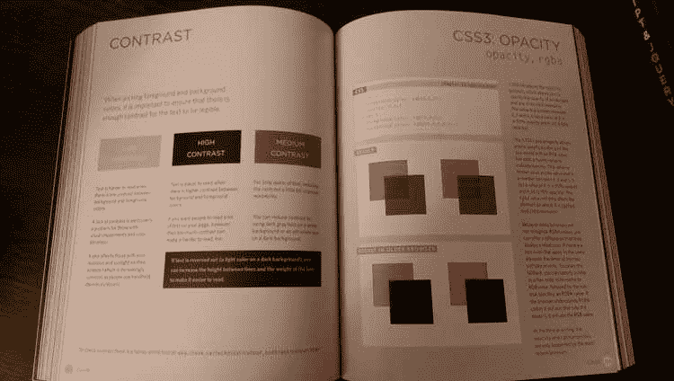
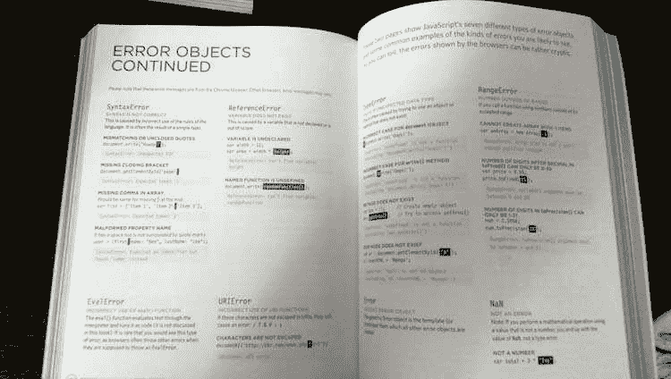
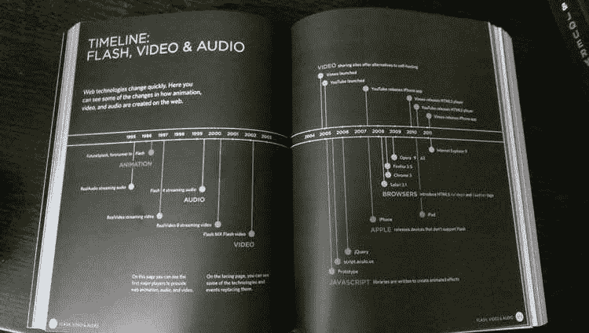

# 为什么不是所有的编程书都是这个样子？

> 原文：<https://dev.to/alexhyettdev/why-can-t-all-programming-books-look-like-this-5709>

这些年我读了相当多的编程书籍。它们中的许多对于学习一门新的编程语言非常有用，而有些则没什么帮助。不幸的是，所有这些书都有一个共同点，那就是读起来很乏味。这不一定是作者的错，编程更像是一门实用的学科，阅读一页又一页的代码过一段时间后会变得有点枯燥。有些书确实试图添加一点幽默来打破单调，但即使这样过一会儿也会有点烦人(是的，我的意思是你先点头)。

然而，已经有几本书脱颖而出，成为阅读的乐趣。这些是乔恩·达克特的 [HTML & CSS](https://geni.us/pXVa) (附属 [*](https://www.alexhyett.com/affiliate-disclaimer) )和 [JAVASCRIPT & JQUERY](https://geni.us/dDOTGI) (附属 [*](https://www.alexhyett.com/affiliate-disclaimer) )。我得到了这两本书作为圣诞礼物，它们看起来比你的标准开发书籍好多了。你只需要看看封面就知道它不会和你放在书架上的那本 580 页的 C++一样。

现在我承认这个主题不像一本关于企业架构模式的书那么深入，这可能会使页面布局更容易。然而，我确实从这两本书中学到了不少东西。这本 [HTML & CSS](https://geni.us/pXVa) (附属 [*](https://www.alexhyett.com/affiliate-disclaimer) )的书很好地解释了一些你可能甚至不知道存在的更晦涩的 HTML5 标签。 [JAVASCRIPT & JQUERY](https://geni.us/dDOTGI) (附属 [*](https://www.alexhyett.com/affiliate-disclaimer) )这本书比前一本厚了大约 50%，无论你处于什么水平，它都是很好的伴侣指南。

## 页面设计

最突出的是每个页面设计得有多好。为了让这些页面看起来更好，我们付出了很多努力。我希望我写的网站和文档看起来有这个的一半好。只要看一下这几页

[T2】](///static/f024b2d4c8671c8157fb763d0dfa44ec/acb04/contrast_opacity_html_and_css_jon_duckett.jpg)

这一页是关于错误处理，甚至看起来不错: 

整本书有一些很棒的图表，就像这个关于技术的时间线: 

我会把这些书放在家里的桌子上，它们不仅可以作为网站建设的重要参考，还可以作为如何编写文档的范例。如果你想买的话，现在你可以在亚马逊上买到它们。

你有什么最喜欢的编程书籍推荐吗？如果有，请在下面评论。