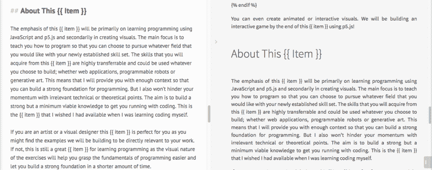
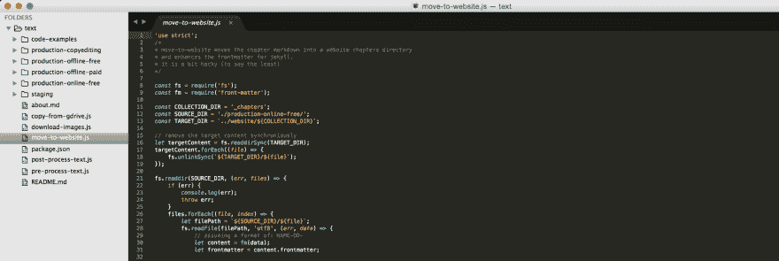

# 作为程序员写书

> 原文：<https://dev.to/inspiratory/writing-a-book-as-a-programmer>

*注:这篇文章最初发表在 [Hackernoon](https://hackernoon.com/writing-a-book-as-a-developer-f02b887880f5) 上。*

我最近做了一件让我颇感意外的事情。我最终写了一本书，甚至没有意识到。

[T2】](https://res.cloudinary.com/practicaldev/image/fetch/s--IDkCy2GR--/c_limit%2Cf_auto%2Cfl_progressive%2Cq_66%2Cw_880/http://i.giphy.com/CDJo4EgHwbaPS.gif)

在这篇文章中，我将讨论我的书/互动课程[面向视觉学习者的编码](http://www.codingforvisuallearners.com/)是如何产生的，以及从技术角度看，作为一名程序员写一本书是什么样的。我还将谈一谈创建在线课程，因为这是我写作之旅的起点。如果您时间不够，您可以跳到本文的第三部分，在那里我将讨论我最终使用了什么样的工具来编写和出版一本书，或者查看 TL；贝博士。但请记住，有时旅程比目的地更有回报。

[T2】](https://res.cloudinary.com/practicaldev/image/fetch/s--zbJbXyU2--/c_limit%2Cf_auto%2Cfl_progressive%2Cq_66%2Cw_880/http://i.giphy.com/LvUdlLZB4eAuY.gif)

**TL；博士:**

*   从你最熟悉的工具开始。当你刚开始时，保持低摩擦是很重要的。
*   您新出现的需求将通知您具体的工具决策，因此开始创建而不是停留在计划上。
*   我尝试了[workflow](https://workflowy.com/)和[idea . so](https://www.notion.so/)进行写作。看中了 [StackEdit.io](https://stackedit.io/) 的降价支持、云同步和离线编辑功能。这是一个足够好的选择，但在收集对你的材料的反馈时可能会有所欠缺。
*   利用 [YAML front matter](https://jekyllrb.com/docs/frontmatter/) 在文本中包含元数据和 [Nunjucks 模板](https://mozilla.github.io/nunjucks/)语言能够使用条件和变量。
*   创建 node.js 脚本来移动文档，并根据所需的输出格式(离线与在线)对它们进行预处理和后处理。
*   我的过程是自动化的，但没有过度设计。记住，[做不可扩展的事情](http://paulgraham.com/ds.html)。
*   我和一个校对一起工作
*   使用 [Leanpub](https://leanpub.com/) 自行出版并生成多种格式的无品牌电子书，在[亚马逊 Kindle 商店](https://kdp.amazon.com/)出售。
*   如果你打算自助出版，这篇由 Zapier 撰写的链接文章是必读书。
*   我使用 Educative.io 从我现有的材料中创建了一个互动的动画课程。

* * *

### 第一部分:我是如何在连自己都没有意识到的情况下写了一本书？

让我们从适当的介绍开始。我的名字是 [Engin](http://www.enginarslan.com/) ，我是一名软件开发人员、教育家，现在是一名作家。我已经在一所大学教授 Python 入门课程两年多了，几个月前，我还开始创建在线课程/视频教程。我通常会在录音前写下整个课程的脚本，以便有一个更可预测和可重复的结果。换句话说，我不擅长即兴创作。我最终写的这些脚本通常非常全面，几乎包含了我打算在录制过程中说的每一个词。去年我在 Pluralsight 上发布了我的第一个在线课程，[使用 PhantomJS 和 CasperJS](https://www.pluralsight.com/courses/automating-web-phantom-js-casper-js) 实现网络自动化。如果您还没有这样做，您应该检查一下。没关系，我会等你回来。

这次我想创建另一个在线课程，但我想自己做所有的事情，以便在课程创建方面有更多的端到端体验。我一生都在为别人工作，从来没有自己处理过任何交易。我认为开设一门课程可能是一个很好的尝试商业方面的练习，因为它需要我处理营销或分销之类的事情。在我的初步研究中，我发现了学习编码的可视化方法的市场空白，并选择使用优秀的 JavaScript 库 [p5.js](http://p5js.org/) 来教授初学者编程。作为一个自学成才的程序员，我清楚地记得新程序员面临的挣扎。我开始着手创建一种课程，这种课程在我起步时会对我有所帮助。

为了编写我将在录制期间阅读的脚本，我一直在使用一个名为 [Workflowy](https://workflowy.com/) 的服务。它本质上是一个列表创建器，你可以在其中创建[深度嵌套的可折叠列表](https://workflowy.com/s/pqJ.DP2AAng7Ar)。我发现这种界面很好地映射了我如何构建我的思维。它允许我为每两个句子创建一个新的列表项。这使得重新组织你的文本变得非常简单，只需拖放即可。折叠列表有助于隐藏和管理复杂性。

Workflowy 也很好地映射了我最初的录音。我一次只记录几个句子，因为感觉长时间连续记录会增加我演讲中出错的机会。 **#ESL**

> **学习一**:后来我发现这并不是最好的录音方式。这种粒度水平会大大增加您的编辑和录制时间。一位音频工程师建议我试着批量录音(比如试着一口气完成所有的工作)，然后试着在以后编辑/修补它。

Workflowy 是一个很棒的工具，我已经使用它很多年了，也用于其他与生产力相关的目的。它让书写和记笔记变得容易和没有摩擦，但是它不擅长显示代码片段、图像或除了纯文本之外的任何东西。几个月前，我偶然发现了[idea](https://www.notion.so/)，并对它的功能印象深刻。它基本上类似于 Workflowy，因为它也可以创建无限嵌套的列表，但也可以创建几乎任何东西(清单、格式化代码片段、减价文档等),只要是组织/生产力工具。我决定把我的工作转移到观念，继续在那里写作。它完美的界面让我对我正在进行的工作更加自豪，并让我意识到我正在开发的文本可能会比预期的更好。具有代码突出显示、图像导入等功能。这个想法让我看到如果我的作品在纸上(也就是数字纸)会是什么样子。**审美的确很重要。**

在这一点上，我注意到我已经写了超过 150 页。使用列表项使我的方法非常迭代，它们容易折叠的特性隐藏了我自己的进展。我注意到我写了一本书，甚至没有意识到。这就是你写书的方式。一句一句来，朋友。一句一句来。

[T2】](https://res.cloudinary.com/practicaldev/image/fetch/s--MFK_GOcX--/c_limit%2Cf_auto%2Cfl_progressive%2Cq_66%2Cw_880/http://i.giphy.com/sM4ALgO3D7F8k.gif)

> **学习二:**小事加起来。我每天只写几个谈话要点，但随着时间的推移，他们给了我足够的材料来把它们写成一本书。拥有能让我以一致的方式工作的系统真的有助于实现一个非凡的最终结果。媒介的选择也很有帮助。列表让事情变得原子化，可折叠的列表对我隐藏了越来越多的工作，防止我因引发焦虑而自毁前程。

这是事情开始变得有点技术性的地方，因为我手头有一个问题。一本书需要一个连续的文本，而我拥有的是一个巨大的句子列表。出于不同的原因，我需要保留这两种格式。当时，一个列表帮助我记录在线课程，但是如果我要从这个文档创建一个文本主体，那就有问题了。输入编码。

* * *

### 第二部分:选择写作平台

我从来没有真正理解为什么自助出版一本书可能需要编程。但是我开始明白了。

概念有一个选项来导出我的脚本作为一个降价文件。我需要将这个 Markdown 文件(本质上是一个巨大的嵌套列表)转换成一个扁平的文本体。为此，我使用了 node.js [Markdown 库](https://github.com/evilstreak/markdown-js)。这工作得很好，但剩下的问题是，它现在是一个 HTML 文档，有一个巨大的未排序列表。离实用还有很长的路要走。

此时，我开始使用另一个名为 [Cheerio](https://github.com/cheeriojs/cheerio) 的 node.js 库，以便能够将生成的 HTML 处理成所需的形式。Cheerio 是一个库，它在服务器端提供了类似 JQuery 的语法，用于操作超文本数据。尽管 Cheerio 在一定程度上是有帮助的，但它仍然不能让我一直坚持下去。

因此，我决定在我的文本中添加类型提示。基本上，提供一组标签来指导 Cheerio 进行正确的操作。我会添加一个`{{ h1 }}`来指示列表标题需要是 h1 标题，或者在一些句子前添加一个`{{ + }}`符号来指示一个项目需要与前一个项目合并来创建一个段落。

然而，就在这个时候，可怕的事情发生了。观念决定推出一组沟通不畅的更新，这阻止了我连续几天写文章。当时，概念是一个相对较新的服务，所以他们的桌面应用程序在缓存在线数据方面也不是很好。我发现自己无法在工作时间工作，因为云服务不可用。这是不要太相信云服务的一个惨痛教训。连续几天，这个想法让我失败了几次，让我意识到我需要为我的写作找一个新的家。

这并不是说观念是一种糟糕的服务。它实际上是一种令人惊叹的产品。但我犯了一个错误，在他们产品开发的早期阶段，事情仍在不断变化，他们的离线应用程序在与在线平台同步方面不太好，所以我过于依赖它。

> 如果事情变得不可访问，你需要有一种离线工作的方式。你不能假设云会一直存在。

我开始寻找替代我的工作流程的方法，并很快解决了这个问题。它允许您使用本地缓存在浏览器中编写 Markdown。它也可以以一种简单的方式与 Google Drive 同步。大约在这个时候，我也发现我以前的录音方式并不是很低效。一次只录制(和编写)几个句子的脚本有点太细了，而且会降低编辑的速度。这促使我将所有的写作内容以平面 markdown 文本的形式转移到 StackEdit.io 中，完全摆脱了列表结构。

> **学习四:**刚起步的时候没有对错的工具。**对**、**错**、**最好**的概念存在于互联网的点击标题领域。如果我一开始就沉迷于我的工具，我将无法做任何有意义的工作。你会把事情搞砸，这没关系。这是旅程和学习过程的一部分。

* * *

### 第三部分:出版编码

此时，我已经在 StackEdit 中写完了所有的东西，我也去掉了所有之前添加的样式提示，因为我可以继续利用 Markdown 语法。StackEdit 可以自动与 Google Drive 同步，所以我也有办法获取我正在处理的文件进行离线处理。我终于有了一个可靠的方法来建立一个管道。这就是编码充分发挥作用的地方。

我希望能够从我的 Markdown 源文件中创建多个输出。我已经开始研究书中更深入的部分，并开始考虑将其作为一种高级产品。我想用这些材料制作一本电子书，但我也想在我的 Jekyll 网站上展示同样的材料。这已经暗示了源文本的四种不同变体，如**在线免费**、**在线付费**、**离线免费**、**离线付费**。在线和离线输出的另一个区别是，我可以在在线版本中使用视频(gif)文件，但这些相同的视觉效果在离线版本中需要是静态图像。

现在我开始理解编程如何帮助我的过程。我有一个单一的权威来源和多种需要管理的输出格式，这开始看起来越来越像一个自动化问题。

我开始构建 node.js 脚本来建立我的工作流。我已经将我的 Google Drive 同步到了我磁盘上的一个文件夹中。因此，我编写了一个脚本，将所需文件从 Google Drive 提取到我的工作文件夹中，并将其放在暂存区。

```
 'use strict';

    const fs = require('fs');

    const SOURCE_DIR = '/Users/username/Google Drive';
    const TARGET_DIR = './staging';

    // remove the target content synchroniously
    let targetContent = fs.readdirSync(TARGET_DIR);
    targetContent.forEach((file, index) => {
        let targetFile = `${TARGET_DIR}/${file}`
        let isFile = fs.lstatSync(targetFile).isFile();
        if (isFile) {
            fs.unlinkSync(targetFile);
        }
    });

    fs.readdir(SOURCE_DIR, (err, files) => {
        files.forEach((file) => {
            if (file.startsWith('p5js-') && !file.endsWith('.gdoc')) {
                fs.createReadStream(`${SOURCE_DIR}/${file}`)
                    .pipe(fs.createWriteStream(`${TARGET_DIR}/${file}.md`));
            }
        });
    }); 
```

我在托管在 [imgur](http://imgur.com/) 上的 Markdown 文件中引用的图片。我构建了另一个脚本，将这些图像下载到暂存文件夹中。我需要图片在我的本地编辑电子书。

然后，我创建了另一个脚本，该脚本将预处理临时区域中的文件，并将它们移动到基于目标位置确定的相应文件夹中。为了能够在在线和离线版本以及付费和免费版本之间呈现不同的内容，我决定使用 [Nunjucks](https://mozilla.github.io/nunjucks/) 模板语言。这为我解决了两个主要用例:

使用 Nunjucks，我能够根据目标输出格式有条件地呈现内容。例如，我的文档中的 gif 可能表示为:

```
 
```

有了 if-else 语句，我可以在预处理脚本中设置一个变量来决定执行哪个条件，并使用这个数据来呈现 Nunjucks 模板。

```
const data = {online: true}; 
let renderedContent = nj.renderString(content, data); 
```

Nunjucks 还允许我创建变量。我可以在我的减价文本中使用一个类似于`{{ item }}`的变量，它可以根据我要到达的目的地呈现出`book`或`course`的值。(我最终使用书本材料创建了一个交互式课程，我需要将该材料称为“课程”，稍后会详细介绍)。

[T2】](https://res.cloudinary.com/practicaldev/image/fetch/s--EwPkJ5KR--/c_limit%2Cf_auto%2Cfl_progressive%2Cq_auto%2Cw_880/http://i.imgur.com/sg1VUlu.png)

使用预处理脚本，我还可以使用名为 [front-matter](https://github.com/jxson/front-matter) 的节点库来操作我在原始 Markdown 文件中的 front matter。这需要完成，因为我的目标输出格式之一是 Jekyll 的. md 文件，我想自动添加一些额外的前端属性供 Jekyll 解析。

这一切听起来可能有点过度设计，而且没有必要。这很有可能是真的。但是我对这个过程感到高兴的一点是，即使我屈服于开发人员在面对最轻微的问题时使用工具的倾向，我也没有过分沉迷于构建通用的、可扩展的解决方案。我写的所有这些代码在这里分享起来都非常丑陋和尴尬，但关键是要快速行动，以一种不会浪费你时间的方式构建自动化解决方案。主要目标不是构建系统来交付你的内容，而是尽可能地交付内容。[你应该做一些不可扩展的事情](http://paulgraham.com/ds.html)。

> **学习五:**一定要读一读保罗·格拉厄姆写的关于做不成比例的事情的文章。效率不高的事情会在短期内给你带来巨大的影响。但是，如果你在刚刚起步的时候就陷入了对可扩展性的担忧，那么你可能会错过成长的机会和动力的来源，比如向人们传递价值的感觉，这可能会阻碍甚至破坏你的进步。

我后悔的一个技术决策是对我的文件系统操作使用承诺。我想我试图证明自己使用它们很舒服，但是对于我的情况来说，它们完全是多余的，因为我没有任何性能问题。承诺的过度使用开始产生精神负担，我只想快速地进行，因为它们不像同步操作那样简单。游戏开发者乔纳森·布洛有一个关于开发个人项目时优化认知负荷的精彩演讲。当然，这不是他所做的任何事情的规模，但如果你只是在做一些需要工作的事情，不管你如何需要确保它尽可能可用。不要试图变得聪明，因为大多数时候你会比最聪明的自己更笨。

我还创建了一个后处理文件，我将运行它来实现一些特定的目的。例如，将文档发送给一个编辑(我曾在 [Fiverr](http://(https//www.fiverr.com)) 和一个自由职业者一起工作过)，我不需要代码片段，因为它们会增加我的字数，从而影响定价。有了自动化的工作流程，我可以轻松地删除它们。有一个例子，我面临一个相反的问题，我只需要代码片段。通过使用后处理文件有选择地从文件中删除目标元素(任何不是代码片段的东西),这个问题又被快速解决了。

[T2】](https://res.cloudinary.com/practicaldev/image/fetch/s--5ysUjex2--/c_limit%2Cf_auto%2Cfl_progressive%2Cq_auto%2Cw_880/http://i.imgur.com/dqNWyj4.png)

我最终在三个不同的平台上发布了我的作品。我第一次在 Leanpub 上发表这本书。已经建立了一个管道，很容易将我的工作与 Leanpub 集成，并使用他们的 Github 集成。在 Leanpub 上推出我的作品后，我使用他们的工具导出了这本书的无品牌版本，并将其放在亚马逊 Kindle 商店上。[扎皮尔](https://zapier.com/blog/how-to-publish-ebook/)在自助发布平台上发表了一篇令人惊叹的博文。这是任何对这个领域感兴趣的人的必读之作。

对我来说，最惊人的发现是通过黑客新闻上的一个帖子看到的。Educative.io 是一个在线课程创建网站，在这里您可以使用块来构建交互式课程，允许您以一种简单的方式在文档中添加可执行代码片段(以及许多其他内容)。这允许您创建类似于 Jupyter 笔记本的文档。将我的源文本转移到他们的平台上轻而易举，因为它也使用了 Markdown 格式。

我并不是说我的工作流程是完美的。一个很大的缺点是从其他人那里收集对我的文本的在线反馈相当困难。对于这个用例，使用谷歌文档会有用得多。但不幸的是，谷歌文档并没有提供一个处理降价文件的好方法。

此外，在源文本中使用 Nunjucks 模板会带来一点开销，因为您不能只是复制粘贴文本，您需要首先处理“编译”它。但是考虑到获得的效率，我发现这是一个合理的权衡。

这总结了我的旅程。如果这里有最后一个教训的话，我认为那就是不要一开始就过分沉迷于工具和最佳实践，而要从创造事物开始。真正重要的是内容和产品，所有其他问题都是次要的，至少在最初是这样。不要让你自己被选择拖了后腿，你可能在开始时不知道足够的信息来通知你的决定，所以开始并根据你的新需求反复调整是很重要的。

* * *

[T2】](https://res.cloudinary.com/practicaldev/image/fetch/s--NHpZOewz--/c_limit%2Cf_auto%2Cfl_progressive%2Cq_66%2Cw_880/http://i.giphy.com/zGnnFpOB1OjMQ.gif)

**感谢**走到这一步！请随意查看为视觉学习者编写的[代码](http://www.codingforvisuallearners.com/)，也可以通过[推特](http://www.twitter.com/inspiratory)或[我的网站](http://www.enginarslan.com/)联系我，提出你的意见、建议和问题。

同样**感谢**T2【海恩和 [Myplanet](https://medium.com/@myplanethq) 的 Leigh 阅读本文的草稿。