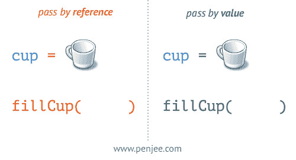

# YDKJS

> 原文：<https://dev.to/vsimonovski/ydkjs-2m91>

**Y**ou**D**on t**K**now**J**avaScript，是 Kyle Simpson 关于 JavaScript 核心机制的[巨著系列](https://github.com/getify/You-Dont-Know-JS)。不幸的是，对于大多数 Web 开发人员来说，这是一个残酷的事实。

> 虽然 JavaScript 可能是最容易上手和运行的语言之一，但它的古怪之处使得对这种语言的扎实掌握远不如其他语言常见。编写一个完整的程序需要对 C 或 C++这样的语言有相当深入的了解，而完整的产品 JavaScript 可以，而且经常，仅仅触及语言的皮毛。

我完全同意。此外，JavaScript 新手的一个大问题是期望 JavaScript 的行为像其他编程语言一样，然而，JavaScript 有自己的一套想法和解决问题的方法，有些不好，有些好，大多数都很棒。

最初的想法是涵盖 YDKJS 系列的所有书籍，我意识到这将是“重新发明轮子”的大部分时间，所以我决定只涵盖一些额外的例子[到&再到](https://github.com/getify/You-Dont-Know-JS/tree/master/up%20%26%20going)。下面的文字代表了其他 YDKJS 书籍中深入涉及的主题的简要总结，**文章不是阅读所有 YDKJS 书籍**的替代品，主要目的是让您对 YDKJS 书籍系列和 javascript 本身更感兴趣。

* * *

## 类型

JavaScript 是松散类型的，这并不意味着 JavaScript 没有类型，你只是不需要编写它们。

以下是可用的内置类型:

*   `string`
*   `number`
*   `boolean`
*   `null`和`undefined`
*   `object`
    *   `function`
    *   `array`
    *   `date`
    *   `regExp`
*   `symbol`

您可以使用`typeof`操作符检查变量的类型。你也可以称之为`typeof(variable)`。

```
let a

console.log(typeof a) // "undefined"

a = 'Some text'

console.log(typeof a) // "string"

a = 42

console.log(typeof a) // "number"

a = true

console.log(typeof a) // "boolean"

a = nullconsole.log(typeof a) // "object" <- Caution!
a = undefined

console.log(typeof a) // "undefined"

a = {
  b: 'c',
}

console.log(typeof a) // "object" 
```

Enter fullscreen mode Exit fullscreen mode

这可能如你所料，但是再次注意`typeof(null)`返回一个对象，所以举例来说，如果你想检查某个变量是否是一个对象，你可以这样做:

```
let object = {}
let falseObject = null

function isObj(arg) {
  return typeof of === 'object' && arg !== null
}

console.log(isObj(object)) // true
console.log(isObj(falseObject)) // false 
```

Enter fullscreen mode Exit fullscreen mode

* * *

## 物体

在 JavaScript 中，对象是一个独立的实体，具有属性和类型。例如，与汽车相比。汽车是一个有属性的物体。一辆汽车有一种颜色、一种设计、一种类型、几个门等等。同样，JavaScript 对象可以有属性，这些属性定义了它们的特征。

您可以通过两种方式访问对象属性。【点符号】

```
let ShibaInu = {
  legs: 4,
  race: 'Dog',
  sex: 'Male',
}

ShibaInu.legs // 4
ShibaInu['race'] // "Dog" 
```

Enter fullscreen mode Exit fullscreen mode

对象是通过引用传递的，而不是通过值。

```
let objA = {
    prop: "Some property value";
}

let objB = objA; // objB now "points" to objA object

objA.prop2 = "Another property value";

objB.prop2; // "Another property value" 
```

Enter fullscreen mode Exit fullscreen mode

[T2】](https://res.cloudinary.com/practicaldev/image/fetch/s--ia6fM8C8--/c_limit%2Cf_auto%2Cfl_progressive%2Cq_66%2Cw_880/https://blog.penjee.com/wp-content/uploads/2015/02/pass-by-reference-vs-pass-by-value-animation.gif)

关于 JavaScript 对象的更多信息。

## 数组

数组是一个对象，它保存(任何类型的)值，不是特别在命名属性/键中，而是在数字索引位置中。例如:

```
let arr = [
    "1",
    23,
    { a : "b", c : "d" },
    function() { console.log("Hi!")
];

arr[0]; // "1"
arr[3](); // "Hi!" 
```

Enter fullscreen mode Exit fullscreen mode

因为数组是对象，所以它们也可以有属性，包括自动更新长度属性。

```
// arr from previous example
console.log(arr.length) // 4

arr.returnFirst = function() {
  return this[0]
}

arr.returnLast = function() {
  let len = this.length
  return this[len - 1]
}

arr.returnFirst() // "1"
arr.returnLast() // function () { ... }

// returnLast() returns function since last element of arr is a function
// we can invoke it with another set of ()
arr.returnLast()() // "Hi!" 
```

Enter fullscreen mode Exit fullscreen mode

## 功能

JavaScript 实现了一流的功能。这基本上意味着您可以将函数视为任何其他类型。你可以传递它们，你可以内联声明它们，你可以从其他函数返回它们，等等..

函数和 JS 中的许多其他东西一样，都是对象。就像数组一样，它们也可以有属性。关于函数的更多细节，现在这里有一个小例子:

```
function ultimateQuestionOfLife() {
  return 42
}

ultimateQuestionOfLife() // 42 
```

Enter fullscreen mode Exit fullscreen mode

## 比较数值

您可以使用以下运算符之一来比较值:

*   `==`
*   `!=`
*   `===`
*   `!===`
*   `Object.is()` (ES6)

任何比较的结果都是布尔值，真或假。`==`和`===`的主要区别在于强制。`==`允许强制而`===`不允许。

在比较值之前，知道什么被评估为真和假是很方便的。

虚假值:

*   `""` -空字符串
*   `0`、`-0`、`NaN`
*   `null`，`undefined`
*   `false`

真实值:

*   `"hello"`
*   `42`
*   `true`
*   `[]`
*   `{}`
*   `function bar() { ... }`

## 变量

有效名称:必须以`a-z`、`A-Z`、`$`或`_`开头，可以包含这些字符加上数字`0-9`。

## 吊装

> 只要一个变量出现在一个作用域中，这个声明就属于整个作用域，可以在任何地方访问。打个比方，当 var 声明在概念上被“移动”到其封闭范围的顶部时，这种行为被称为提升。从技术上讲，这个过程更准确地解释为代码是如何编译的，但是我们现在可以跳过这些细节。

考虑这个例子:

```
var a = 2

foo() // works because foo() declaration
// is hoisted

function foo() {
  a = 3
  console.log(a) // 3
  var a // declaration is hoisted
  // on top of foo()
}

console.log(a) 
```

Enter fullscreen mode Exit fullscreen mode

或者:

```
var a = 42

function bar() {
  console.log(typeof a) // "function"
  a = 23
  function a() {}
  return a
}

bar()
console.log(a) // 42 
```

Enter fullscreen mode Exit fullscreen mode

所以`function a()`被提升到函数`function bar()`的顶部，然后我们给它一个值 23，所以它变成一个数字，最后我们返回它。由于这种行为，全局`a`变量保持不变。

当你声明一个变量时，它在这个范围内的任何地方都是可用的。JavaScript 过去只有函数作用域，这意味着创建函数会创建新的作用域。ES6 改变了，引入了`let`关键字，使用`let`可以声明块范围。

```
function bScope() {
  var a = 10
  if (a >= 10) {
    let a = 5
  }
  console.log(a)
}

function fScope() {
  var a = 10
  if (a >= 10) {
    var a = 5
  }
  console.log(a)
}

bScope() // 10
fScope() // 5 
```

Enter fullscreen mode Exit fullscreen mode

## 严格模式

ES5 在语言中加入了“严格模式”。严格模式收紧了某些行为的规则。一般来说使用严格模式，你的代码会变得“更安全”，这并不意味着你的代码会变得防错或完美，但会更接近于此。

```
function foo() {
    "use strict";
    // this code is in strict mode
    function bar() {
        // this code is in strict mode
    } 
```

Enter fullscreen mode Exit fullscreen mode

或者:

```
'use strict'
// this code is in strict mode
function foo() {
  // this code is in strict mode
  function bar() {}
} 
```

Enter fullscreen mode Exit fullscreen mode

严格模式不允许隐式自动全局变量声明省略`var`关键字。

```
function foo() {
  'use strict'
  a = 42 // var missing, ReferenceError
}

foo() 
```

Enter fullscreen mode Exit fullscreen mode

## 立即调用函数表达式(IIFEs)

生活是非常有用的，让我们来看一些例子:

```
(function IIFE() {
  console.log('Hi from IIFE!')
})()

// "Hi from IIFE!" 
```

Enter fullscreen mode Exit fullscreen mode

包围函数的外层`( .. )`只是一个防止它被当作普通函数声明的机制。表达式末尾的最后一个`()`是执行函数的部分。

创造生命的同时你也创造了新的变量作用域，所以你可以用生命来做这样的事情:

```
var a = 42
(function IIFE() {
  var a = 10
  console.log(a) // 10
})()

console.log(a) // 42 
```

Enter fullscreen mode Exit fullscreen mode

IIFEs 也可以有返回值:

```
var x = (function IIFE() {
  return 42
})()

console.log(x) // 42 
```

Enter fullscreen mode Exit fullscreen mode

## 闭合

闭包是引用独立(自由)变量(局部使用的变量，但是在封闭范围内定义)的函数。换句话说，这些功能“记住”它们被创建的环境。

学习和理解闭包的动力很小，最近我参加了几次面试，其中 90%的面试我的任务是写两个数相加的函数，函数必须以这种方式调用:`sum( arg1 )( arg2 )`

解决方案:

```
let sumES6 = x => {
  return y => {
    return x + y
  }
}

console.log(sumES6(2)(3)) // 5 
```

Enter fullscreen mode Exit fullscreen mode

如果你不熟悉 ES6 的箭头功能，这里是等效的 ES5 的例子:

```
let sumES5 = function(x) {
  return function(y) {
    return x + y
  }
}

console.log(sumES5(2), 3) // 5 
```

Enter fullscreen mode Exit fullscreen mode

由于这种机制，我们可以设置一个参数，稍后传递另一个参数。在我们的例子中，我们对`sumES6`函数进行了两次调用。在第一次调用时，我们返回对内部函数的引用，在第二次调用时，我们返回`x + y`值。闭包让我们可以访问在第一次调用中传递的`x`值。

### 模块模式

> JavaScript 中闭包最常见的用法是模块模式。模块允许您定义对外部世界隐藏的私有实现细节(变量、函数)，以及可从外部访问的公共 API。

考虑这个例子:

```
function Employee() {
  let name, surname

  function returnSalary(nm, srnm) {
    name = nm
    surname = srnm

    // connect to a database
    // return salary or smth. similar here ...
  }

  let publicAPI = {
    salary: returnSalary,
  }

  return publicAPI
}

// create a `Employee` module instance
let john = Employee()

john.salary('John', 'Doe') 
```

Enter fullscreen mode Exit fullscreen mode

因此，`publicAPI`对象在 Employee 被调用后返回，`john`将访问该对象的 sallary 属性，这将再次返回内部 returnSallary 函数。

### 这个关键字

`this`是 javascript 中非常特殊的机制，它的值主要取决于执行的上下文。

> 如果一个函数内部有一个 this 引用，那么这个引用通常指向一个对象。但是它指向哪个对象取决于函数是如何被调用的。重要的是要认识到这不是指函数本身，这是最常见的误解。

```
function foo() {
  console.log(this.bar)
}

let bar = 'global'

let obj1 = {
  bar: 'obj1',
  foo: foo,
}

let obj2 = {
  bar: 'obj2',
}

// --------

foo() // "global"
obj1.foo() // "obj1"
foo.call(obj2) // "obj2"
new foo() // undefined 
```

Enter fullscreen mode Exit fullscreen mode

这里有四个规则来说明如何设置，它们显示在代码片段的最后四行。

*   `foo()`最终在非严格模式下将它设置为全局对象——在严格模式下，这将是未定义的，并且在访问 bar 属性时会出现错误——因此“global”是 this.bar 的值。
*   `obj1.foo()`将此设置为 obj1 对象。
*   `foo.call(obj2)`将此设置为 obj2 对象。
*   将它设置为一个全新的空对象。

* * *

我就停在这里。想了解更多信息，可以考虑看看 YDKJS 书籍概述。

我希望您喜欢这篇文章，并且您对学习 javascript 比阅读本文之前更感兴趣。请记住:

[T2】](https://i.giphy.com/media/ijxKTF6iE4K4M/giphy.gif)